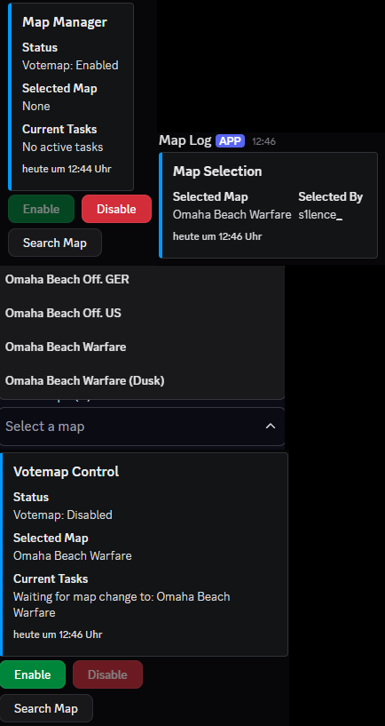

<div align="center">

  
  <h1>HLL-VOTEMAP-MAP-INJECTOR</h1>
  
<!-- Badges -->
<p>
  <a href="https://github.com/2KU77B0N3S/hll-geofences/graphs/contributors">
    
  </a>
  <a href="">
    
  </a>
  <a href="https://github.com/2KU77B0N3S/hll-geofences/network/members">
    
  </a>
  <a href="https://github.com/2KU77B0N3S/hll-geofences/stargazers">
    
  </a>
  <a href="https://github.com/2KU77B0N3S/hll-geofences/issues/">
    
  </a>
  <a href="https://github.com/2KU77B0N3S/hll-geofences/blob/master/LICENSE">
    
  </a>
</p>
   
<h4>
  <a href="https://github.com/2KU77B0N3S/hll-geofences">Documentation</a>
  <span> · </span>
  <a href="https://github.com/2KU77B0N3S/hll-geofences/issues/">Report Bug</a>
  <span> · </span>
  <a href="https://github.com/2KU77B0N3S/hll-geofences/issues/">Request Feature</a>
</h4>
</div>

<br />

# Table of Contents
1. [HLL Votemap Map Injector](#hll-votemap-map-injector)
2. [Features](#features)
3. [Prerequisites](#prerequisites)
4. [Installation](#installation)
5. [Usage](#usage)
6. [Notes](#notes)
7. [License](#license)

# HLL Votemap Map Injector

A Discord bot for "injects" a map while votemap is running on a game server using the CRCON API.

## Features
- Enable/disable votemap functionality via Discord buttons
- Search and select maps from a predefined list
- Automatically disable votemap when a map is selected and re-enable when the map is active
- Send webhook notifications for map selections (Logging)



## Prerequisites
- Node.js (v16 or higher)
- A Discord bot token
- A CRCON server API key
- A Discord webhook URL (optional)
- A `maps.selection.json` file containing available maps

## Installation
1. Clone the repository:
   ```bash
   git clone https://github.com/2KU77B0N3S/hll-votemap-map-injector.git
   cd hll-votemap-map-injector
   ```
2. Install dependencies:
   ```bash
   npm install
   ```
3. Create a `.env` file in the root directory with the following:
   ```env
   CRCON_SERVER=https://your-crcon-server.com
   CRCON_API_KEY=your-api-key
   DISCORD_TOKEN=your-discord-bot-token
   CHANNEL_ID=your-discord-channel-id
   DISCORD_WEBHOOK=your-discord-webhook-url
   ```

## Usage
1. Start the bot:
   ```bash
   node main.mjs
   ```
2. The bot will:
   - Connect to Discord and the specified channel
   - Clear the channel of old messages
   - Post an embed with control buttons for enabling/disabling votemap and searching maps
3. Interact with the bot via:
   - **Enable/Disable Buttons**: Toggle votemap functionality
   - **Search Map Button**: Open a modal to search for maps, then select from a dropdown
   - The bot will update the embed with the current status and tasks

## Notes
- The bot verifies API actions with retries to ensure reliability
- Map changes are monitored every 15 seconds when a map is selected
- Errors are logged to the console and displayed in Discord
- The bot requires the `maps.selection.json` file to load available maps

## License
MIT License
